# 💬 Live Chat Analyzer

A real-time, distributed system for analyzing and summarizing high-volume chat streams from live broadcasts. The system is designed to handle thousands of messages per second, providing immediate sentiment analysis and periodic summaries to viewers and broadcasters.

## ✨ Features

- **High-Volume Chat Ingestion**: Reliably processes and stores thousands of chat messages per second.
- **Real-Time Sentiment Analysis**: Instantly analyzes and displays the sentiment of each chat message.
- **Periodic Chat Summarization**: Generates periodic summaries of the conversation, providing a quick overview of the chat's context.
- **Live Viewer Count**: Tracks and displays the number of viewers in a broadcast in real-time.
- **Scalable, Distributed Architecture**: Built on a microservices architecture using a message-driven approach, allowing for independent scaling of components.
- **Containerized & Orchestrated**: Fully containerized with Docker and ready for deployment on Kubernetes.

## 📹 Demo
The system performs real-time sentiment analysis on chat messages to categorize viewer responses (e.g., compliments, insults, humor). For chat summarization, the system triggers a summary generation after every 20 new messages by preprocessing and aggregating the previous 100 comments. This summary is generated via the OpenAI API and reflected on the viewer interface dynamically.


## 🚀 System Architecture

This project is composed of several microservices and a data processing pipeline that work together to provide real-time analysis.

```mermaid
graph TD
    %% Modern Styling with Icons & Gradients
    classDef client fill:#FFEBEE,stroke:#D32F2F,stroke-width:4px,color:#000,font-weight:bold
    classDef service fill:#E3F2FD,stroke:#1976D2,stroke-width:4px,color:#000,font-weight:bold
    classDef pipeline fill:#FFF8E1,stroke:#F57C00,stroke-width:4px,color:#000,font-weight:bold
    classDef infra fill:#E8F5E9,stroke:#388E3C,stroke-width:4px,color:#000,font-weight:bold
    classDef monitoring fill:#FFFDE7,stroke:#FBC02D,stroke-width:4px,color:#000,font-weight:bold
    classDef security fill:#F3E5F5,stroke:#7B1FA2,stroke-width:4px,color:#000,font-weight:bold

    %% External Access Layer
    subgraph "🌐 External Access"
        User[👨‍💻 User's Browser]
        Vercel[▲ Vercel - Frontend Hosting]
        Ingress[🚪 Kubernetes Ingress]
    end

    %% Kubernetes Core
    subgraph "☸️ Kubernetes Cluster"
        subgraph "🎯 Backend Services"
            UserServer[👤 User Server<br/>Spring Boot]
            ChatServer[💬 Chat Server<br/>Spring Boot]
        end

        subgraph "📨 Kafka Streams"
            RawChats[📥 raw-chats]
            Analysis[📊 analysis-result] 
            SummaryReq[✉️ summary-requests]
            Summary[📝 summary-results]
            Connect[🔗 Kafka Connect]
            KafkaTopicsInit[Job: Kafka Topics Init]
        end

        subgraph "⚡ Processing Pipeline"
            Flink[⚙️ Apache Flink<br/>Real-time Analysis]
            Spark[✨ Apache Spark<br/>Batch Summaries]
        end

        subgraph "💾 Data Layer"
            Redis[⚡ Redis<br/>Pub/Sub + Cache]
            Cassandra[🗃️ Cassandra<br/>Chat History]
            MySQL[📊 MySQL<br/>User/Stream Meta]
        end

        subgraph "📊 Monitoring Stack"
            Prometheus[📈 Prometheus]
            Grafana[📊 Grafana Dashboards]
            KafkaExporter[📦 Kafka Exporter]
        end

        subgraph "🔒 Security & Management"
            CertManager[🛡️ Cert-Manager]
            K8sDashboard[🖥️ K8s Dashboard]
        end
    end

    %% Apply Beautiful Styling
    class User client;
    class Vercel client;
    class Frontend,UserServer,ChatServer service;
    class Flink,Spark pipeline;
    class RawChats,Analysis,SummaryReq,Summary,Connect,KafkaTopicsInit pipeline;
    class Redis,Cassandra,MySQL infra;
    class Prometheus,Grafana,KafkaExporter monitoring;
    class CertManager,K8sDashboard security;

    %% 🎯 Critical Data Flows (Simplified & Clear)
    User -.->|"Traffic"| Ingress
    User -.->|"Access"| Vercel

    Ingress -->|API| UserServer
    Ingress -->|WS| ChatServer
    Vercel -->|API| Ingress

    %% User Server
    UserServer <-->|"CRUD"| MySQL
    UserServer <-->|"Cache/Tokens"| Redis

    %% Chat Processing Pipeline  
    ChatServer -->|"Raw Messages"| RawChats
    RawChats -->|"Stream Processing"| Flink
    Flink -->|"Analysis"| Analysis
    Analysis --> ChatServer
    Flink -->|"Trigger Summary"| SummaryReq
    SummaryReq --> Spark
    Spark -->|"Summaries"| Summary
    Summary --> ChatServer

    %% Persistence & Distribution
    RawChats -->|"Sink"| Connect
    Connect --> Cassandra
    ChatServer <-->|"Live Updates (Pub/Sub)"| Redis

    %% Monitoring
    Prometheus -->|Scrapes Metrics| UserServer
    Prometheus -->|Scrapes Metrics| ChatServer
    Prometheus -->|Scrapes Metrics| Flink
    Prometheus -->|Scrapes Metrics| Spark
    Prometheus -->|Scrapes Metrics| KafkaExporter
    Grafana -->|Queries Metrics| Prometheus

    %% Security & Management
    CertManager -->|Issues TLS Certs| Ingress
    KafkaTopicsInit -->|Creates Topics| RawChats
    KafkaTopicsInit -->|Creates Topics| Analysis
    KafkaTopicsInit -->|Creates Topics| SummaryReq
    KafkaTopicsInit -->|Creates Topics| Summary
```



This project is built using a distributed microservices architecture, leveraging Kubernetes for orchestration and Vercel for frontend hosting.

### Core Components

-   **Frontend (Vercel)**: A **Vue.js** single-page application hosted externally on **Vercel**, providing the user interface.
-   **User Server (Spring Boot)**: Manages user authentication, stream metadata, tracks viewer counts, and publishes updates to Redis. Delivers real-time viewer count updates via **Server-Sent Events (SSE)**.
-   **Chat Server (Spring Boot)**: Handles real-time communication via **WebSockets (STOMP)**, publishes raw chat messages to Kafka, consumes processed data from Kafka, and distributes updates to clients via dynamic Redis Pub/Sub channels.

### Data & Processing Pipeline

-   **Kafka**: Acts as the central, durable message broker.
    -   `raw-chats`: A topic for all incoming raw chat messages from the `chat-server`.
    -   `summary-requests`: A topic used to trigger the Spark summarization job.
    -   `analysis-results` & `summary-results`: Topics for processed data from the analysis pipeline.

-   **Flink**: A stream-processing framework that consumes from `raw-chats`, performs real-time sentiment analysis, and publishes results back to a Kafka topic. It also sends messages to the `summary-requests` topic to trigger periodic summarization.

-   **Spark**: A distributed processing framework that consumes from the `summary-requests` topic to periodically generate chat summaries from the data in Cassandra/Kafka.

-   **Redis**: Used as a high-speed, in-memory backbone for real-time messaging, caching, and state management.
    -   **Pub/Sub Backplane**: Functions as a messaging backplane. Services publish updates to dynamic `broadcast:{streamId}` channels, allowing `chat-server` instances to subscribe only to the streams their clients are watching, enabling efficient message fan-out.
    -   **Stream Data & Caching**: Stores the set of active user IDs for each stream (used to calculate live viewer counts) and caches the generated chat summaries.
    -   **Authentication State**: Stores user refresh tokens to manage authentication sessions and enable secure token rotation.

-   **Cassandra**: A highly-scalable NoSQL database used for the persistent storage of all chat messages from the `raw-chats` topic.

## 🛠️ Tech Stack

-   **Frontend**: `Vue.js`
-   **Backend**: `Java`, `Spring Boot`
-   **Messaging/Streaming**: `Apache Kafka`, `WebSockets`, `SSE`
-   **Stream Processing**: `Apache Flink`
-   **Batch Processing**: `Apache Spark`
-   **Database**: `Cassandra` (Primary Storage), `Redis` (Pub/Sub & Caching)
-   **Infrastructure**: `Docker`, `Kubernetes`, `Prometheus`, `Grafana`

## 📂 Project Structure

```
.
├── chat-generator/    # Scripts to generate mock chat data for testing
├── chat-server/       # Spring Boot service for WebSocket chat handling
├── user-server/       # Spring Boot service for user and stream management
├── docs/              # Documentation for deployment and queries
├── frontend/          # Vue.js frontend application
├── infra/             # Docker-compose setup and configurations for infrastructure (Kafka, Flink, Spark, etc.)
└── k8s/               # Kubernetes manifests for production deployment
```

## 📄 License

This project is licensed under the MIT License. See the `LICENSE` file for more details.