# Project Architecture

This document provides a detailed overview of the Live Chat Analyzer system architecture, illustrating the components and data flows.

## Architecture Diagram (Mermaid)

The following diagram can be rendered on platforms like GitHub to visualize the system's structure.

```mermaid
graph TD
    %% Modern Styling with Icons & Gradients
    classDef client fill:#FFEBEE,stroke:#D32F2F,stroke-width:4px,color:#000,font-weight:bold
    classDef service fill:#E3F2FD,stroke:#1976D2,stroke-width:4px,color:#000,font-weight:bold
    classDef pipeline fill:#FFF8E1,stroke:#F57C00,stroke-width:4px,color:#000,font-weight:bold
    classDef infra fill:#E8F5E9,stroke:#388E3C,stroke-width:4px,color:#000,font-weight:bold
    classDef monitoring fill:#FFFDE7,stroke:#FBC02D,stroke-width:4px,color:#000,font-weight:bold
    classDef security fill:#F3E5F5,stroke:#7B1FA2,stroke-width:4px,color:#000,font-weight:bold

    %% External Access Layer
    subgraph "🌐 External Access"
        User[👨‍💻 User's Browser]
        Vercel[▲ Vercel - Frontend Hosting]
        Ingress[🚪 Kubernetes Ingress]
    end

    %% Kubernetes Core
    subgraph "☸️ Kubernetes Cluster"
        subgraph "🎯 Backend Services"
            UserServer[👤 User Server<br/>Spring Boot]
            ChatServer[💬 Chat Server<br/>Spring Boot]
        end

        subgraph "📨 Kafka Streams"
            RawChats[📥 raw-chats]
            Analysis[📊 analysis-result] 
            SummaryReq[✉️ summary-requests]
            Summary[📝 summary-results]
            Connect[🔗 Kafka Connect]
            KafkaTopicsInit[Job: Kafka Topics Init]
        end

        subgraph "⚡ Processing Pipeline"
            Flink[⚙️ Apache Flink<br/>Real-time Analysis]
            Spark[✨ Apache Spark<br/>Batch Summaries]
        end

        subgraph "💾 Data Layer"
            Redis[⚡ Redis<br/>Pub/Sub + Cache]
            Cassandra[🗃️ Cassandra<br/>Chat History]
            MySQL[📊 MySQL<br/>User/Stream Meta]
        end

        subgraph "📊 Monitoring Stack"
            Prometheus[📈 Prometheus]
            Grafana[📊 Grafana Dashboards]
            KafkaExporter[📦 Kafka Exporter]
        end

        subgraph "🔒 Security & Management"
            CertManager[🛡️ Cert-Manager]
            K8sDashboard[🖥️ K8s Dashboard]
        end
    end

    %% Apply Beautiful Styling
    class User client;
    class Vercel client;
    class Frontend,UserServer,ChatServer service;
    class Flink,Spark pipeline;
    class RawChats,Analysis,SummaryReq,Summary,Connect,KafkaTopicsInit pipeline;
    class Redis,Cassandra,MySQL infra;
    class Prometheus,Grafana,KafkaExporter monitoring;
    class CertManager,K8sDashboard security;

    %% 🎯 Critical Data Flows (Simplified & Clear)
    User -.->|"Traffic"| Ingress
    User -.->|"Access"| Vercel

    Ingress -->|API| UserServer
    Ingress -->|WS| ChatServer
    Vercel -->|API| Ingress

    %% User Server
    UserServer <-->|"CRUD"| MySQL
    UserServer <-->|"Cache/Tokens"| Redis

    %% Chat Processing Pipeline  
    ChatServer -->|"Raw Messages"| RawChats
    RawChats -->|"Stream Processing"| Flink
    Flink -->|"Analysis"| Analysis
    Analysis --> ChatServer
    Flink -->|"Trigger Summary"| SummaryReq
    SummaryReq --> Spark
    Spark -->|"Summaries"| Summary
    Summary --> ChatServer

    %% Persistence & Distribution
    RawChats -->|"Sink"| Connect
    Connect --> Cassandra
    ChatServer <-->|"Live Updates (Pub/Sub)"| Redis

    %% Monitoring
    Prometheus -->|Scrapes Metrics| UserServer
    Prometheus -->|Scrapes Metrics| ChatServer
    Prometheus -->|Scrapes Metrics| Flink
    Prometheus -->|Scrapes Metrics| Spark
    Prometheus -->|Scrapes Metrics| KafkaExporter
    Grafana -->|Queries Metrics| Prometheus

    %% Security & Management
    CertManager -->|Issues TLS Certs| Ingress
    KafkaTopicsInit -->|Creates Topics| RawChats
    KafkaTopicsInit -->|Creates Topics| Analysis
    KafkaTopicsInit -->|Creates Topics| SummaryReq
    KafkaTopicsInit -->|Creates Topics| Summary

```

## Data Flow Explanation

### 1. **Core Components**

-   **Frontend (Vercel)**: A **Vue.js** single-page application hosted externally on **Vercel**, providing the user interface.
-   **User Server (Spring Boot)**: Manages user authentication, stream metadata, tracks viewer counts, and publishes updates to Redis. Delivers real-time viewer count updates via **Server-Sent Events (SSE)**.
-   **Chat Server (Spring Boot)**: Handles real-time communication via **WebSockets (STOMP)**, publishes raw chat messages to Kafka, consumes processed data from Kafka, and distributes updates to clients via dynamic Redis Pub/Sub channels.

### 2. **Data & Processing Pipeline**

-   **Kafka Cluster**: The central, durable message broker for all event streams.
    -   `raw-chats`: Stores all incoming raw chat messages.
    -   `analysis-result`: Contains real-time sentiment analysis results from Flink.
    -   `summary-requests`: Used by Flink to trigger the Spark summarization job.
    -   `summary-results`: Stores periodic chat summaries generated by Spark.
-   **Apache Flink**: Performs real-time sentiment analysis on `raw-chats` and triggers summarization requests.
-   **Apache Spark**: Generates periodic chat summaries based on `summary-requests` and historical data.
-   **Redis**: High-speed, in-memory store for Pub/Sub messaging, caching viewer counts, chat summaries, and user authentication tokens.
-   **Cassandra**: A highly-scalable NoSQL database for persistent storage of all raw chat messages.
-   **MySQL**: Stores structured, relational data like user profiles and stream metadata.

### 3. **Kubernetes Specific Components**

-   **Ingress**: Manages external access to services within the cluster, routing traffic to Backend Services (User Server, Chat Server) and sometimes serving static content if not using an external frontend host like Vercel.
-   **Cert-Manager**: Automates the issuance and renewal of TLS certificates for secure communication, particularly for the Ingress.
-   **Kafka Topics Init Job**: A Kubernetes Job that ensures all necessary Kafka topics are created upon initial deployment.
-   **Kafka Connect**: Integrates Kafka with Cassandra, sinking `raw-chats` data for persistent storage.
-   **Prometheus**: The monitoring system that collects metrics from all application components and infrastructure.
-   **Grafana**: Provides powerful dashboards and visualizations for the metrics collected by Prometheus, offering insights into system performance and health.
-   **Kafka Exporter**: Collects and exposes Kafka broker and topic metrics in a Prometheus-compatible format.
-   **K8s Dashboard**: A web-based Kubernetes user interface that allows users to manage and monitor applications in the cluster.

### 4. **Data Flow Highlights**

-   **User Interaction**: Clients access the **Frontend** hosted on **Vercel**. The Frontend then communicates with the **Kubernetes Ingress** for API calls to the **User Server** and WebSocket connections to the **Chat Server**. Direct SSE connections for real-time updates also flow through Ingress to the User Server.
-   **Real-time Chat/Analysis**: Chat messages -> **Chat Server** -> **Kafka (`raw-chats`)** -> **Flink** (sentiment analysis) -> **Kafka (`analysis-result`)** -> **Chat Server** -> **Redis Pub/Sub (`broadcast:{streamId}`)** -> **Chat Server** (WebSocket) -> Client.
-   **Chat Persistence**: **Kafka (`raw-chats`)** -> **Kafka Connect** -> **Cassandra**.
-   **Periodic Summarization**: **Flink** (trigger) -> **Kafka (`summary-requests`)** -> **Spark** (summarization) -> **Kafka (`summary-results`)** -> **Chat Server** -> **Redis Pub/Sub (`broadcast:{streamId}`)** -> **Chat Server** (WebSocket) -> Client.
-   **Observability**: All services expose metrics which are scraped by **Prometheus**, visualized by **Grafana**. **Kafka Exporter** specifically provides metrics for the Kafka cluster.
